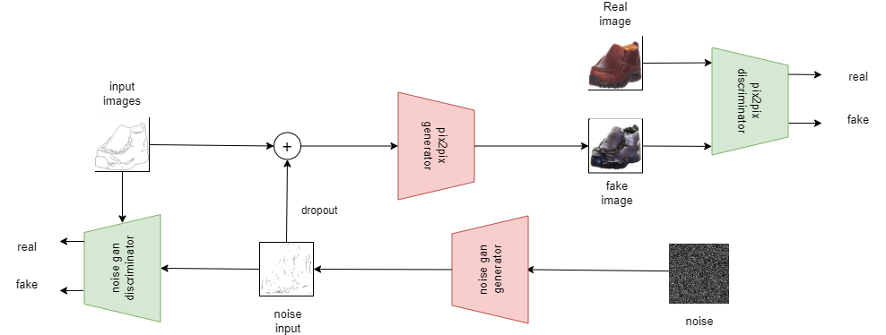

# double_gan and pix2pix in pytorch

**Basic Structure Graph**

 

**Datasets:**

The dataset we recommend to use is from [Bicycle Gan](https://github.com/junyanz/BicycleGAN.git) which is the Berkley official dataset. You can download this datasets through the download scripts. However, you need to edit the folders after download, which you could refer to the path inside the excution python file. You could either change the folder name and path or the path inside the python file.

For other datasets, You can first use the [rmbg](https://github.com/danielgatis/rembg.git) to remove the background and then save the photoes of edge photo and ground truth label photo seperately. For photoes similar to Berkley datasets' you can use the [baseline.py](baseline.py) to do the seperate


**Getting Started**

***first clone and access the repository***
```bash
git clone https://github.com/xiaoyuanzi22333/double_gan.git
cd double_gan
```

***get the data***

put your data or download the data through scripts under the ```./data``` and use ```baseline.py``` to process the data if you need. Remeber to edit the path if you have specific preference and also remember to change them all in other files


***get the edge noise***

run the [baseline.py](baseline.py) to generate the noise.


***get the pix2pix images***

run the [base_pix.py](base_pix.py) to generate the original pix2pix iamges without any addition of the noise


***get the pix2pix+noise images***

1, before doing this, you must make sure you can successfully run the basic edge noise generator and pix2pix generator, especially the edge noise generator, it will provide you with edge noise which you are going to use later.


2, run the [mix_pix.py](mix_pix.py), you can get the pix-level noise mix-up images to train

3, run the [channel_pix.py](channel_pix.py), you can get the channel-level noise mix-up images to train


**Reference**

-[https://blog.csdn.net/qq_44124301/article/details/106153112](https://blog.csdn.net/qq_44124301/article/details/106153112)

-[https://github.com/junyanz/BicycleGAN.git](https://github.com/junyanz/BicycleGAN.git)

-[https://machinelearningmastery.com/how-to-develop-a-pix2pix-gan-for-image-to-image-translation/](https://machinelearningmastery.com/how-to-develop-a-pix2pix-gan-for-image-to-image-translation/)

